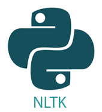

# Text Summarizer



Effortlessly summarize lengthy texts with the Text Summarizer. Extract key insights, improve readability, and save time in information retrieval.

## Features

- **Smart Summarization:** Utilizes advanced natural language processing (NLP) techniques.
- **Easy to Use:** Simple API for integrating with your applications or using directly.
- **Customizable:** Adjust summarization parameters based on your preferences.
- **Fast and Efficient:** Quickly generates concise summaries from extensive texts.

## Demo

Include a GIF or screenshot demonstrating your project in action.


## Getting Started

1. **Installation:**
   ```bash
   pip install text-summarizer
